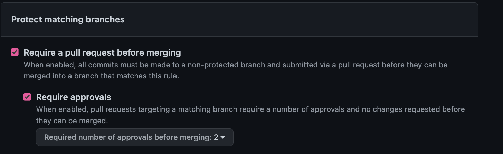
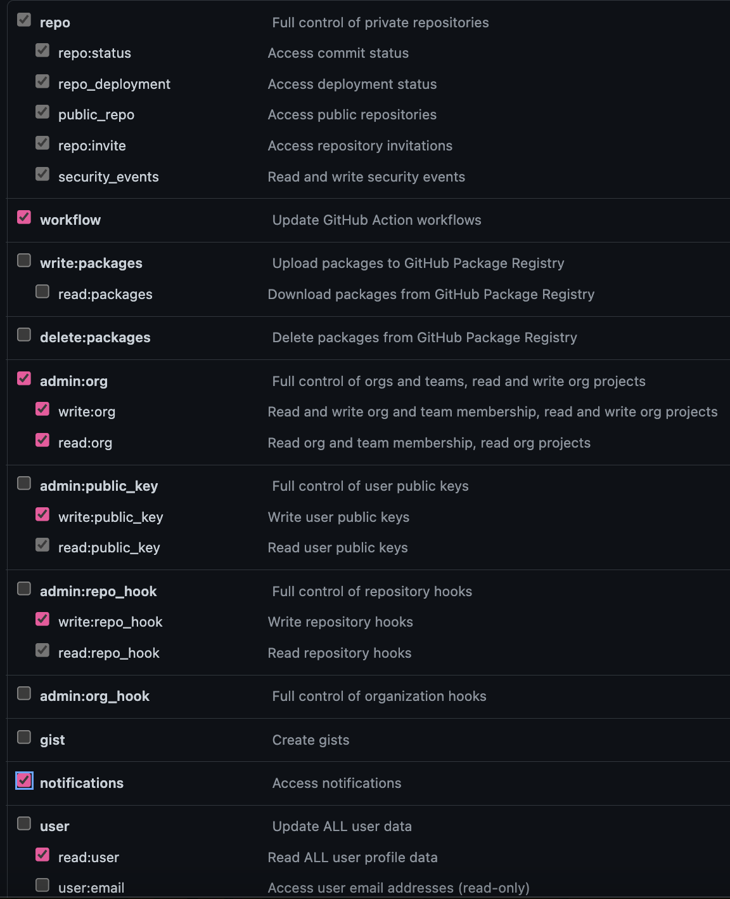

# GitHub Settings

## Branch protection rules

These were the key branch protection rules enabled for this automation to work as intended. Its advisable to look at all the other settings as some are highly recommended.

## Token permissions

These were the token permissions enabled for this automation to work as intended. It's advisable to review these to ensure all are indeed required as this could impact security.

